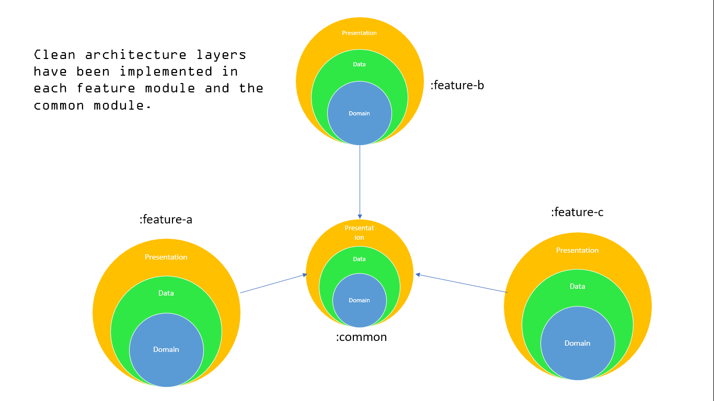
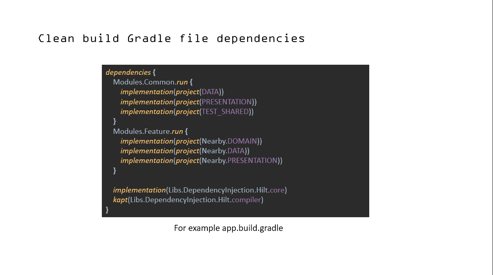
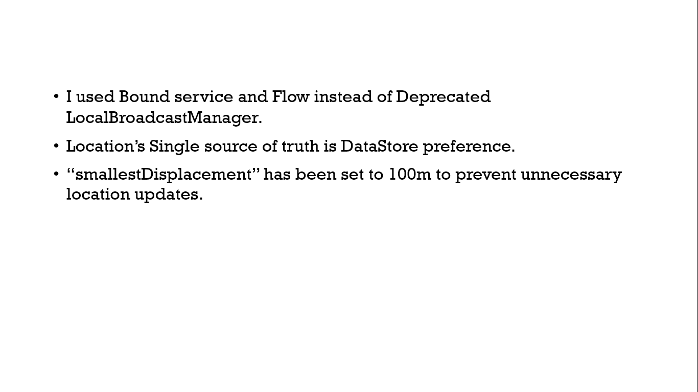

Shows nearby places and updates results through walking only if the location has been moved more than 100 meters with First-offline support. Used technologies: Kotlin Coroutines Kts Clean-MVVM arch Jetpack Datastore Unit test, Bound Service

Thank you for reading !
