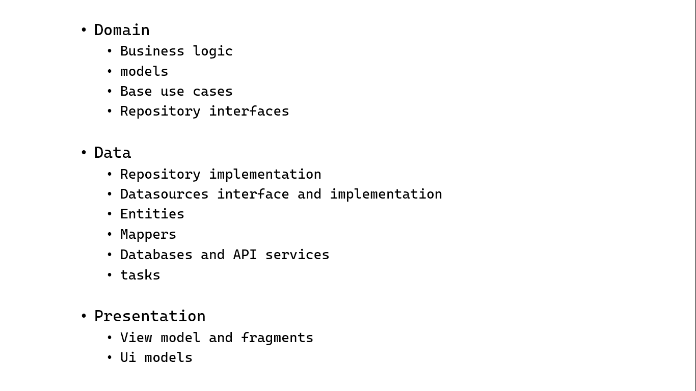

Shows a list of dog by breeds that can be bookmarked and persist on phone locally. Bookmarks can be filtered by breed. Used technologies: Kotlin-Coroutines-Compose-Kts-Clean MVI arch-Jetpack Datastore-Unit test.  
Modularization had been updated with the latest Android doc guidlines : https://developer.android.com/topic/modularization/patterns

Thank you for reading !
